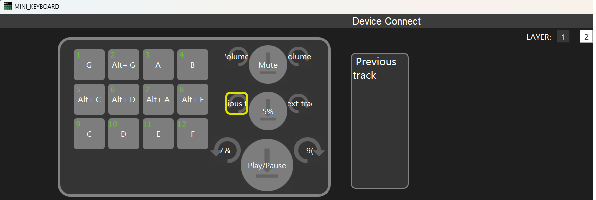

# autiosynth

* a simple keyboard press audio generator ...

## features

* wave forms (sine,Sine,Saw,Square,Triangle)
* keyboard input (show last 5 notes)
* main tones CDEFGA(H|B)
* half tones with strg/alt (CDFGA) => 12 buttons

## planned

* octave switching with controlled by previous track and next track
* UX - simpler user input use with key / waveform switching (by pressing x)

# 