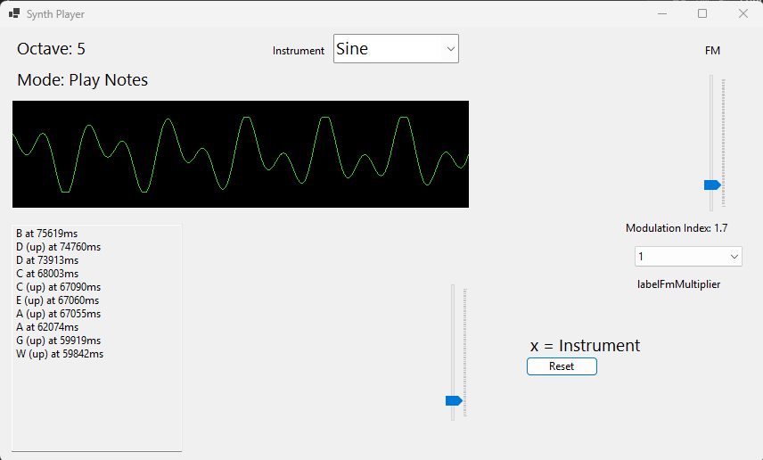

# audiosynth

* audiosynth is a simple  keyboard pressed audio tone generator
* it uses simple software synthisizer technics creating audio with the Naudio Library

* [CHANGELOG](CHANGELOG.md)

## features

* wave forms (sine,Sine,Saw,Square,Triangle,FM)
* keyboard input keydown + keyup (show last 10 notes)
* main tones CDEFGA(H|B)
* half tones with strg/alt (CDFGA) => 12 buttons
* octave switching with controlled by previous track and next track
* UX - simpler user input use with key / waveform switching (by pressing x)
* visualizer

## planned

* keyboard tone mapping config to json file (key, desc, frequency)
* LFO
* json Configs for ADSR
* track/loop function (loop templates)
* multi-language config (german+english)

## Input Device

* Computer-Keyboard Inputs

## CODE Core Components

* [Project CSPROJ](audiosynthSOL/audiosynth/audiosynth.csproj)
* [ADSR: Attack, Decay, Sustain, Release](audiosynthSOL/audiosynth/ADSR.cs)
* [VoideProvider Fuctions: Saw, Square, Triangle,Sine, Noise, FM](audiosynthSOL/audiosynth/VoiceProvider.cs)

gggg